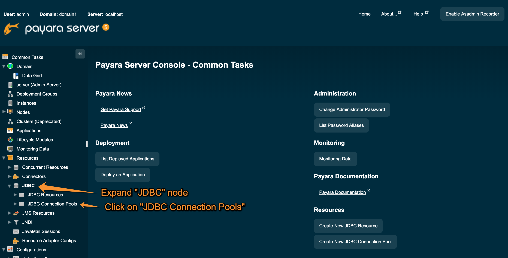
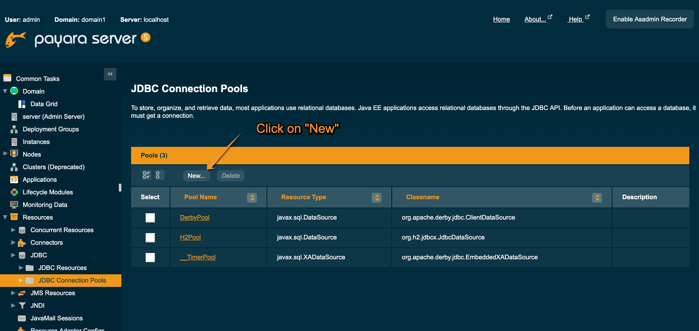
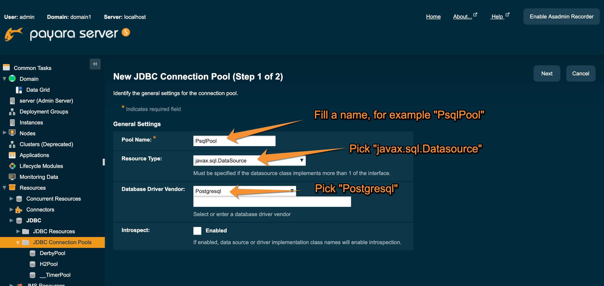
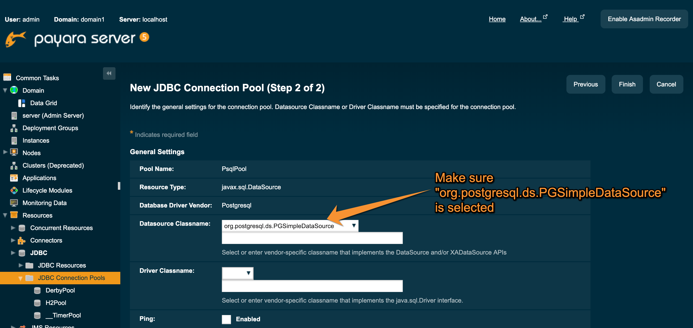
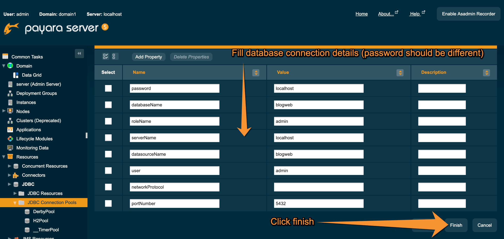
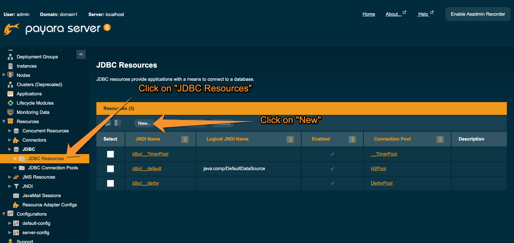
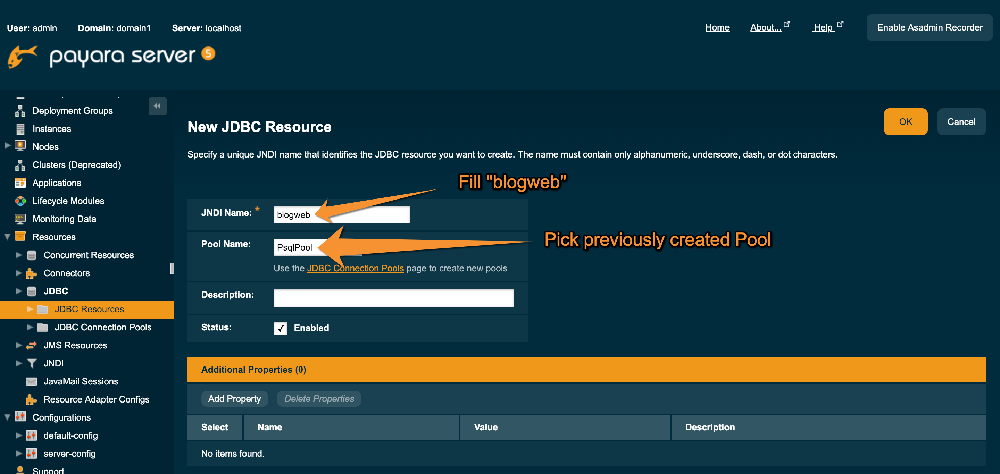

# Blog posts CRUD application

## Application modules

    1 Blog Web REST API
    2 Blog Web Frontend
    3 Blog Web Integration Test
    4 Blog Web Assembly

## Blog Web REST API - technologies used

    Apache Maven
    Spring Boot
    HSQLDB for development purpose
    POSTRGESQL for production setup

## Blog Web REST API - development

To build module, one need to run:

    mvn clean install

To run in development mode, one need to go to blog-web-rest-api directory:

    cd blog-web-rest-api

and run:

    mvn spring-boot:run

This allows to run REST API without being forced to deploy changes to application server.
REST API is served on URL:

    http://localhost:8282/blog-web/posts

NOTE: Port 8282 was picked, in order to make it possible to have Payara server with default settings
up and running while developing.

## BLOG WEB REST API - Swagger UI

In order to make it easier to integrate with REST API, Blog Web REST API has integrated 
Swagger UI. It can be visited on:

    http://localhost:8282/blog-web/swagger-ui.html

in development mode and on:

    http://localhost:8080/blog-web/swagger-ui.html

in PROD mode.

## Blog Web Frontend - technologies used

    Angular 7
    Twitter Boottrap 4

## Blog Web Frontend - development

One may run angular in development mode with command:

    ng serve

Navigate to `http://localhost:4200/`.
The app will automatically reload if you change any of the source files.

### Production package creation

To create a package that can be installed on Payara server a command should be run:

    mvn -Pprod clean package

## Integration Test

Integration tests were written using MockMvc, so they are written in a way,
that each test boots up server on which tests are performed. Such an approach
does not require target server to be up and running.

Tests can be run by running a command:

    mvn test -Dtest="*TestIntegr"

## Application Server setup

In order to deploy Blog-Web application it is required to setup JNDI JDBC blogweb resource.

### Configure JNDI JDBC blogweb resource

To create JNDI JDBC blogweb resource, first you need to create a connection pool.
To do so, please follow screenshots:

After Connection pool is created, you need to create JNDI JDBC blogweb resource.
To do so, follow screenshots:

## Application deployment

To deploy application one may use Payara web interface or run the command:

    $PAYARA_HOME/bin/asadmin deploy $BLOGWEB_DIR/blog-web-assembly/target/blog-web.war

Where `$PAYARA_HOME` is an environment variable that points to directory with Payara
and `$BLOG_WEB` is an environment variable that points to directory with this project.